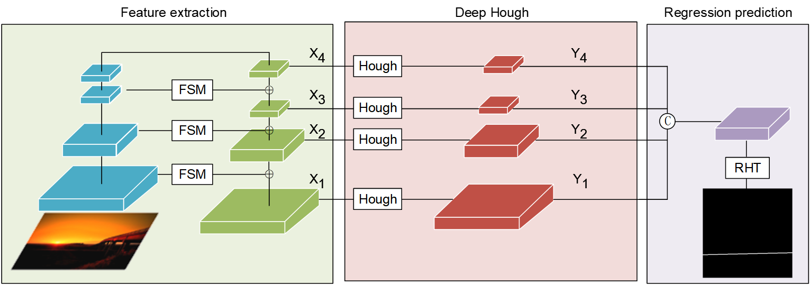
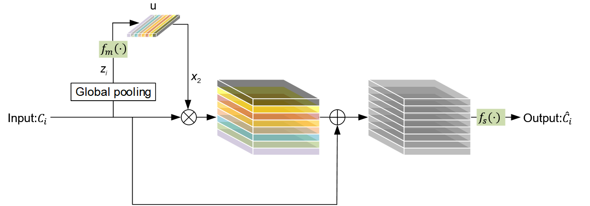
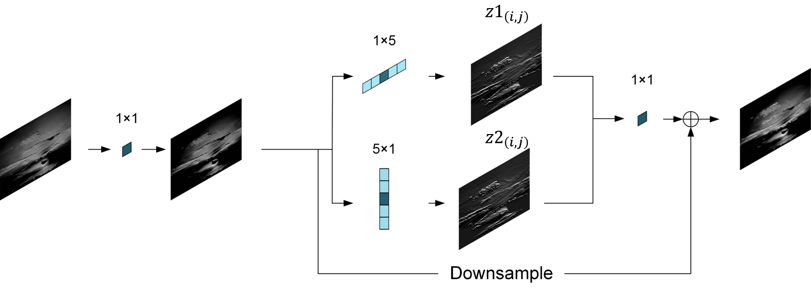
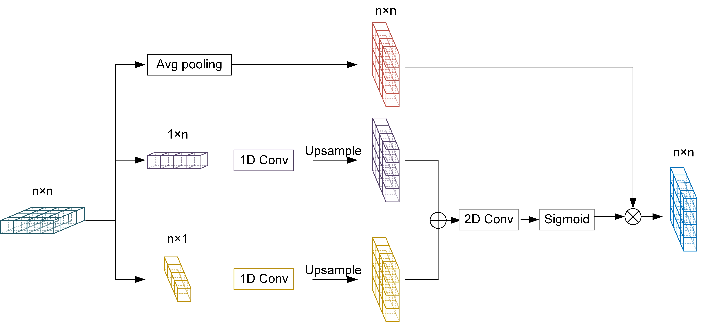

# sml
<h1 style="align: center; color: #159957">Semantic Line Detection Using Deep-Hough Network with Attention Scheme and Strip Convolution</h1>

Initial version **Semantic Line Detection Using Deep-Hough Network with Attention Scheme and Strip Convolution**
[Paper Page]() | [Code Page](https://github.com/zhizhz/sml) 
We are organizing the code and related work.

### Instruction
This paper proposes a novel semantic line detection algorithm based on improvements to the existing algorithm, including attention mechanisms, strip pooling and convolution layers. Although some existing algorithms can recognize semantic lines, their accuracy and speed still need improvement due to the representational nature of semantic lines. To address this, we propose a new semantic line detection algorithm based on an improved deep Hough transform. By using a new multi-scale context aggregation model that combines channel attention mechanisms and strip convolution and pooling layers, we can collect remote semantic background information of image pixels and reduce the impact of redundant information during network transmission, thus reducing errors or incomplete information in semantic line detection. Extensive experiments on the NKL dataset demonstrate that the proposed method outperforms state-of-the-art methods in detecting semantic lines. Finally, to make the network model lightweight, we replace the basic convolution layer with a novel convolutional network layer based on GhostNet, reducing the model's computational complexity and accelerating the network's prediction speed.、
### 
### Network with Attention Scheme and Strip Convolution





### Requirements
``` 
pytorch 1.7.0
python 3.7.0
cuda 11.0
```
### Datasets
SEL dataset from https://mcl.korea.ac.kr/research/Submitted/jtlee_slnet/ICCV2017_JTLEE_dataset.7z [here](https://mcl.korea.ac.kr/research/Submitted/jtlee_slnet/ICCV2017_JTLEE_dataset.7z)

NKL dataset from http://data.kaizhao.net/projects/deep-hough-transform/NKL.zip [here](http://data.kaizhao.net/projects/deep-hough-transform/NKL.zip)

Download the datasets to root/.  data are datasets for semantic line detection.
### Comparison of quantitative results
|        Method |            Presion         |      Recal     | F-measure    |
|:-------------------:|:--------------------------:|:----------------------:|:----------------------:|
|          DHT(ResNet50)|     0.679           |          0.766      |       0.719          |
|       DHT(VGG16)     |        0.659        |             0.759           |       0.706        |
|    HED+HT            |         0.213        |       0.612         |       0.318            |
|         Ours        |          0.697        |        0.783         |        0.733      |


### Thanks
We would like to thank the following individuals and organizations for their contributions to this project:
```
@article{zhao2021deep,
  author    = {Kai Zhao and Qi Han and Chang-bin Zhang and Jun Xu and Ming-ming Cheng},
  title     = {Deep Hough Transform for Semantic Line Detection},
  journal   = {IEEE Transactions on Pattern Analysis and Machine Intelligence (TPAMI)},
  year      = {2021},
  doi       = {10.1109/TPAMI.2021.3077129}
}
```
```
@inproceedings{eccv2020line,
  title={Deep Hough Transform for Semantic Line Detection},
  author={Qi Han and Kai Zhao and Jun Xu and Ming-Ming Cheng},
  booktitle={ECCV},
  pages={750--766},
  year={2020}
}
```
Without the help of these individuals and organizations, this project would not have been possible. Thank you all for your hard work and dedication!

